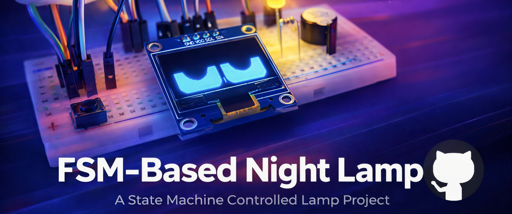
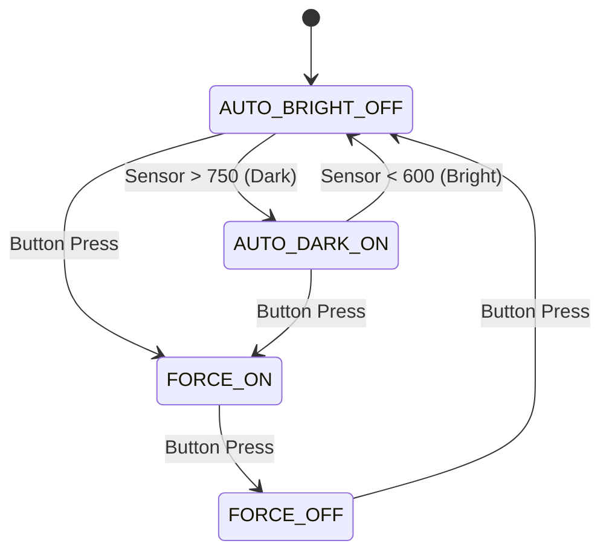

<div align="center">

# The Sentient Lamp
### A Smart Ambient Light System with Personality



[](https://www.arduino.cc/)
[](https://isocpp.org/)
[](./LICENSE)

> *"A minimalist smart lamp that decides when you need light — without cloud, WiFi, or nonsense."*

[View Demo Video](media/demo_video.mp4) • [Report Bug](https://github.com/yourusername/repo/issues)

</div>

---

## 🧠 Overview

**This isn't just a lamp.** It's an Arduino-based embedded system that "lives" on your desk. Using a **Light Dependent Resistor (LDR)** and a **Finite State Machine (FSM)** core, it autonomously manages your lighting based on ambient conditions.

But unlike boring sensors, this one looks back at you. It features a **Event-driven OLED animations that reflect system state** that reacts to the environment—getting "sleepy" when it's bright and "wide awake" when it detects darkness.

### Key Capabilities
* **👁️ Procedural Animation:** Realistic blinking and eye movement (no static bitmaps).
* **🌗 Auto-Day/Night Cycles:** Automatic switching with hysteresis thresholds.
* **🕹️ Manual Override:** Force the system ON or OFF with a tactical button press.
* **⚡ Non-Blocking Core:** zero `delay()` usage ensures smooth animations at 30+ FPS.

---

## 📸 Gallery

| **Day Mode (Auto Off)** | **Night Mode (Auto On)** |
|:---:|:---:|
|  |  |
| *System sleeps. Eyes heavy. Light OFF.* | *System alert. Eyes wide. Light ON.* |

---

## ⚙️ How It Works (The Logic)

The system relies on a **Finite State Machine (FSM)** to prevent erratic behavior. It uses **Hysteresis** to create a stable "dead zone" between light and dark, preventing the lamp from flickering at twilight.

### State Diagram



### The "Personality" Engine

The OLED doesn't just play a GIF. It Uses lightweight logic to simulate eye movement and blinking:

1. **Gaze Tracking:** Random vectors determine where the robot looks.
2. **Blink Logic:** Randomized intervals with smooth eyelid physics.
3. **Expression Mapping:** * *Lazy/Squinting* = High Ambient Light.
* *Wide/Alert* = Low Ambient Light.
* *Dilated Pupils* = Manual Mode Active.


---

## 🔌 Hardware Bill of Materials

| Component | Role |
| --- | --- |
| **Arduino Uno** | The Brain |
| **OLED (SSD1306)** | The Face (0.96" I2C) |
| **LDR Module** | The Eye (Light Sensor) |
| **LED + 220Ω Res** | The Output (Simulated Lamp) |
| **Push Button** | User Input |
| **Piezo Buzzer** | Haptic/Audio Feedback |

---

## 🧪 Technical Deep Dive

### Why Hysteresis?

Without hysteresis, if the light level hovered exactly at the threshold (e.g., 500), the lamp would strobe ON/OFF rapidly. We solved this by separating the thresholds:

* **Turn ON Point:** > 750 (Very Dark)
* **Turn OFF Point:** < 600 (Bright)
* **The Gap (600-750):** The system maintains its *current* state here, ensuring stability.

### File Structure

```bash
├── src/
│   └── SentientLamp.ino       # Matches the repo name (Professional convention)
├── docs/
│   ├── schematic_v1.png       # "Schematic" is more technical than "diagram"
│   └── fsm_architecture.pdf   # "FSM" shows you know the specific logic pattern used
├── assets/                    # "Assets" is standard for images/videos in a repo
│   └── system_preview.mp4     # "System" sounds more robust than "demo"
└── README.md

```

---

## 🚀 Getting Started

1. **Clone the repo**
```bash
git clone [https://github.com/yourusername/smart-lamp.git](https://github.com/yourusername/smart-lamp.git)

```


2. **Wiring**
* LDR → Pin A0
* Button → Pin 2
* OLED → SDA/SCL
* LED → Pin 9


3. **Libraries Needed**
* `Adafruit_GFX`
* `Adafruit_SSD1306`


4. **Upload** via Arduino IDE.

---

## 🔮 Future Roadmap

* [ ] **PWM Dimming:** Instead of ON/OFF, fade the LED based on exact darkness.
* [ ] **RTC Module:** "Sleep" mode where the robot closes its eyes fully after 11 PM.
* [ ] **Physical Enclosure:** 3D printed desktop robot body.

---

<div align="center">

### Created by **Souvik Rahut**

*Frontend • ML • Embedded Systems*

[LinkedIn](https://www.google.com/search?q=https://linkedin.com/in/souvikrahut) • [GitHub](https://www.google.com/search?q=https://github.com/S-o-b-u) • [Email](mailto:souvikrahutofficial@gmail.com)

*"Sometimes the smartest system is the simplest one."*

</div>
